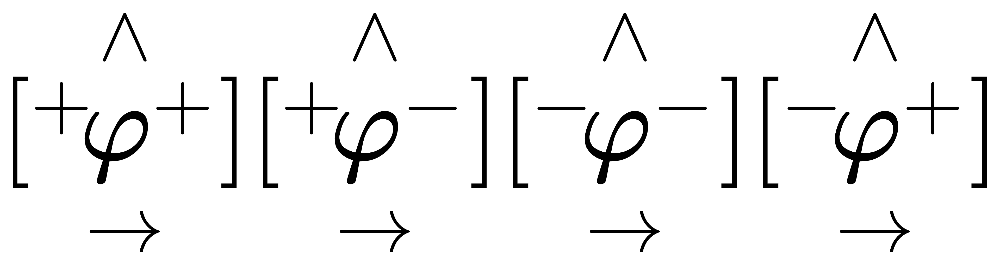
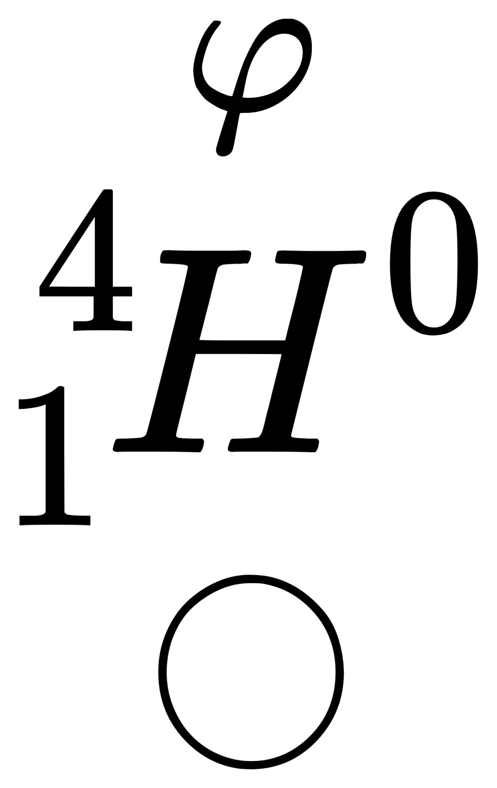

# 源石

在世界中的实体源石被视为*具有'指向特殊的信息域的灵能导体'附着的物质*，
其中“指向特殊的信息域的灵能导体”指`φ粒子`，也被称为源石基本单位。
常见的源石大部分为附着一对或多对`φ粒子对`的硅或碳原子。

一个`φ粒子`具有下面的几个特性：

- 休谟性：休谟性是源石具有的信息特征的核心。这包含一个十一维的休谟向量与一个“长度”。在实体层面上，这表示源石对休谟的放大方向与程度；
  在信息层面上，这意味着`源石内存`中的一块信息域的索引。
- 能量性：源石实体单位内本身存在两重能量：结构能与真空零点能。前者在源石的物理或化学结构变化时改变，后者则在休谟释放的时候改变。
  通常意义上，以源石作为燃料，是释放了源石的结构能内化学能的部分。
- 电性：一个`φ粒子`通常带有一单位正电荷或一单位负电荷。极少数`φ粒子`也会出现不带电荷的情况。

如图：左上角标代表休谟性，右上代表电性。下方箭头代表休谟向量，为十一维相对向量，表示对休谟的放大方向与强度。

上图四个粒子分别为：

- 正休谟φ粒子(正休谟 一单位正电荷)
- 正休谟反φ粒子(正休谟 一单位负电荷)
- 负休谟φ粒子(负休谟 一单位正电荷)
- 负休谟反φ粒子(负休谟 一单位负电荷)

由于正负φ粒子(`惰性φ粒子对`，简称φ粒子对)的结合会形成较为稳定的结构，
因此实际中最常见的是休谟向量相反，“长度”相同的`φ粒子`形成的`φ粒子对`。

## 源石信息性

`φ粒子`具有的休谟向量被视作源石内存的指针。对于源石指针地址的表示，目前尚未形成统一认识，但在一般研究中认为，
“长度”为正时，源石倾向于读取其指向的内容；反之，当“长度”为负时，源石倾向于向该区域写入内容。

研究显示，向一个源石基本单位施加方向相反，强度(可近似理解为“长度”)远高于其的休谟向量，才能使其读写状态发生转变。

# 元素分支

元素分支意味着一个元素出现了改性，在标准内（核内质子数）出现变动。这一变动与同位素不同，其产生的分支元素具有全新的特性且基本稳态。
其根本原因是常规元素原子附着了成对或非成对的`φ粒子`，即变为了类源石态。

所有元素分支的转变中，可能存在`φ粒子对`的形成，分离，重组或元素原子核的结构变化，但*并不存在`φ粒子`本身的变化重构*。
这意味着，元素分支转变的过程可能涉及源石信息展示的重排，但不会改变每个`φ粒子`的信息。换言之，这一过程只是一个重排过程。

对于这些元素，通常不会具有单独的名字，他们会表现为(修饰词)(对应元素)，例如精金。

需要注意的是，并非所有名字符合此模板的都是分支元素。一部分可能为法术纠缠态，例如圣金；另一部分可能是合金的别名，例如青铜。

## 同位元素分支

同位元素分支意味着原子上附着了一对或多对φ粒子对。
由于其稳定的性质，这些分支元素在大多数条件下可以被视为该元素的基态原子的同位素。
但在高休谟偏移环境下，它们会展现出不同寻常的特质。

如下是一个具有一对φ粒子对的氢2(氘)同位分支：

大多数元素都具有一种或多种同位元素分支；其大致规律为，元素化学惰性越高，其所具有的同位元素分支越多。
0族元素具有的同位元素最多，例如氦(He)已经合成了最多拥有14对φ粒子对的同位分支。
当然，这一分支很不稳定，极易发生`φ粒子对脱落`现象，其`第14半脱落周期(λ(He+2φ14))`约只有47.8秒。

### φ粒子对脱落

[//TODO]

## 异位元素分支

异位元素分支是φ粒子单独出现的产物。φ+粒子的单独出现可视为为元素添加质子，φ-则为减少质子。

绝大多数元素(含0族元素)都具有附近1到2位的异位分支，以及相邻的高稳态位分支。这些临近的分支通常被称为`低偏移量分支元素`
且较为稳定。
同理，也存在`高偏移量分支元素`，更加不稳定，且直接制备需要的能量消耗等极高。因此，实际生产中更多的是利用高休谟状态下的`φ粒子交换`
原理。

例如，铝(Al,13)具有Al(φ-3),Al(φ-1),Al(φ+1),Al(φ+2),Al(φ+3),Al(φ+5)等常见较稳定分支。

由于对应的分支表现出的化学性质通常与其有效核电荷数对应的元素相似，因此更多时候被表示为(对应元素)φ(偏移量)。以上方的铝为例：

- Al(φ-3) 又被记为Neφ3- 即 含三个反φ粒子的等效氖原子
- Al(φ-1) 又被记为Mgφ1- 即 含一个反φ粒子的等效镁原子
- Al(φ+1) 又被记为Siφ1+ 即 含一个(正)φ粒子的等效硅原子
- Al(φ+2) 又被记为Pφ2+ 即 含两个(正)φ粒子的等效磷原子
- Al(φ+3) 又被记为Sφ3+ 即 含三个(正)φ粒子的等效硫原子
- Al(φ+5) 又被记为Arφ5+ 即 含五个(正)φ粒子的等效氩原子

以此类推。在通常情况下，孤立φ粒子并不会与其它异性φ粒子发生反应。但在高休谟偏移环境下，可能发生特殊的交互。

交互分为两种，`φ粒子耦合` 与 `φ粒子交换`。两种交互同时存在，但其中一种会占主导地位。
其中，在低休谟环境下，`φ粒子耦合`更有可能占主导地位；而高休谟状态下，`φ粒子交换`更有可能占主导地位。

由于`φ粒子耦合`发生后的粒子将不再参与交互体系，而`φ粒子交换`发生后的粒子会继续参与，
这意味着，**即使是在高休谟环境下，长时间持续的交互体系，最终产物多为`φ粒子耦合`产物**。

### φ粒子耦合

`φ粒子耦合`通常被认为是产生`玻色子重构晶体`的可能途径之一，同时也是产生`强惰性分支元素化合物`的重要途径。

其基本原理就是，一个分支元素的原子核中孤立的φ粒子与另一原子核中孤立的异性φ粒子相互吸引，形成稳定的粒子对。
这一过程在高温高压环境下更易发生，将会形成难以分割的分支元素化合，即`强惰性分支元素化合物`。

更多对粒子孤立φ粒子的耦合将会产生更强的吸引，这意味着更不稳定的原始元素材料制备，更高的温度与压力需求，以及更低的休谟环境。
但这一过程通常会直接使不同的元素直接合并在一起；
由于φ粒子对的存在，这一过程很有可能产生较为稳定的等效同位素与超重元素原子，在对于超重元素，大质量原子，高φ粒子对分支元素的研究上具有巨大意义。

### φ粒子交换

`φ粒子交换`是高效生产`低偏移量分支元素`的重要方法之一。在恰当的条件下，这一过程甚至可以拆分少量φ粒子对。

在正常的交互体系中，不考虑φ粒子对的拆分，不同交互物中孤立的φ粒子将会被相互迁移，且具有微弱的同性吸引效应。

因此，在恰当的体系下，以产物的φ偏移量为横轴，对应产物丰度为纵轴，其大致遵循正态分布图像，且围绕均值(φ偏移量=0)高度集中。

在特殊交互物或催化物的辅助下，可以有效增加高φ偏移量产物的丰度，或通过竞争性交互使均值向一侧偏移。
由于上面已经提及的原因，这一过程需要对时间的精确把控。

## 孤立φ粒子对及其虚化态

[//TODO]

*虚化态是源石能量集束的单元构成之一，也是粒子类源石能量流中的主要种类。

# 玻色子异构晶体

玻色子异构晶体是一类特殊的，难以分解的晶体，该晶体中的单位(晶胞)中，特定位置上的原子内具有非常规的玻色子结合。
这样的原子非常不稳定，但在晶胞内(通常含有𨪛(Or))形成特殊的稳态。这意味着，难以分解的晶胞被破坏后，内部的内容会极快地转化，并产生特殊的结果。

[//TODO]